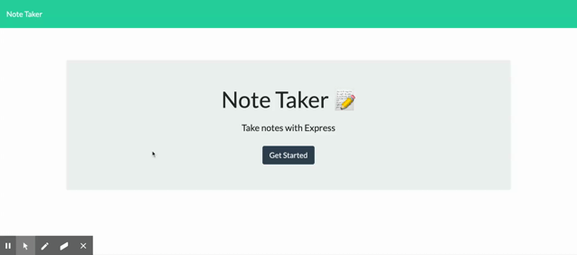
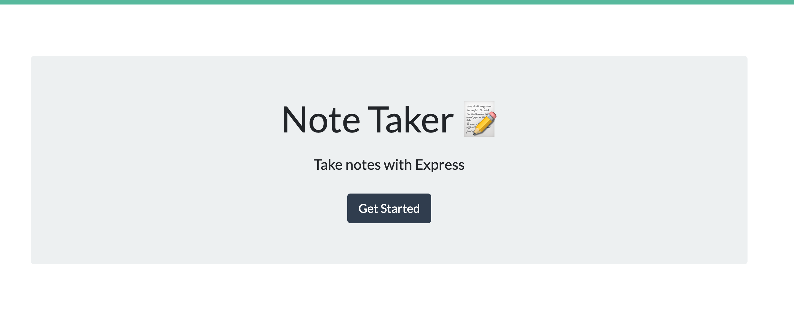
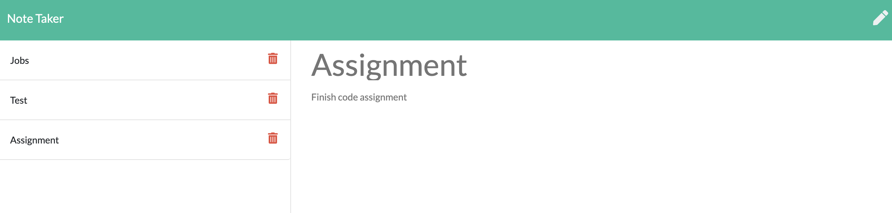

# Unit 11 Express: Note Taker

---

1. [Description and User's Story](#description-and-user's-story)
2. [Functionalities](#functionalities)
3. [Dependencies and Libraries](#list-of-dependencies-and-libraries) 
4. [Installation](#installation)
5. [Demo](#demo)
6. [Licenses](#licenses)
7. [Credits and Acknowledgements](#credits-and-acknowledgements)

---
​
## Description and User's Story 
​
> AS A user, I want to be able to write and save notes
> WANT to be able to delete notes I've written before
> SO THAT I can organize my thoughts and keep track of tasks I need to complete

**Note Taker** is an Express-based application that allows users to write, save and delete simple notes to keep track of tasks and personal information. 

---
​
## Functionalities
​
Currently, the system offers the following *features*:
​
* Application has a landing site.
* Users can access the note taker from the mainn page. 
* Users can then add a note and save it. 
* Users can see all their saved notes or delete them.​
---
​
## Dependencies and Libraries

The application was designed and programmed through a combination of *JavaScript*, *pure HTML*, *pure CSS*, *JQuery*, and *Bootstrap*. The application is functional and hosted in a *Heroku* external server. 

---
​
## Installation
​
If you are interested in running **Note Taker** locally, you can follow these steps:
​
1. Clone or download the repo.
​
2. Using your terminal, navigate into the main repository and run `npm install` in order to install all npm and NodeJS dependencies and libraries (you may also need to install MongoDB or change the database dialect of the schema file).
​​
4. After everything is set, you can then run the application using nodemon or `npm start` using Node in your terminal. After, navigate to your localhost connection on your preferred web browser. 
​
Or, alternatively, you can use the demo page we deployed on a [Heroku](https://www.heroku.com/platform) external server. You can access the functional app [here](https://fathomless-falls-14472.herokuapp.com/). 
​
---
​
​
## Demo
​
The following Gif provides a demonstration of the application's functionalities:

​

---
​
## Licenses
​

​
- - -
© 2019 Trilogy Education Services, a 2U, Inc. brand. All Rights Reserved.
